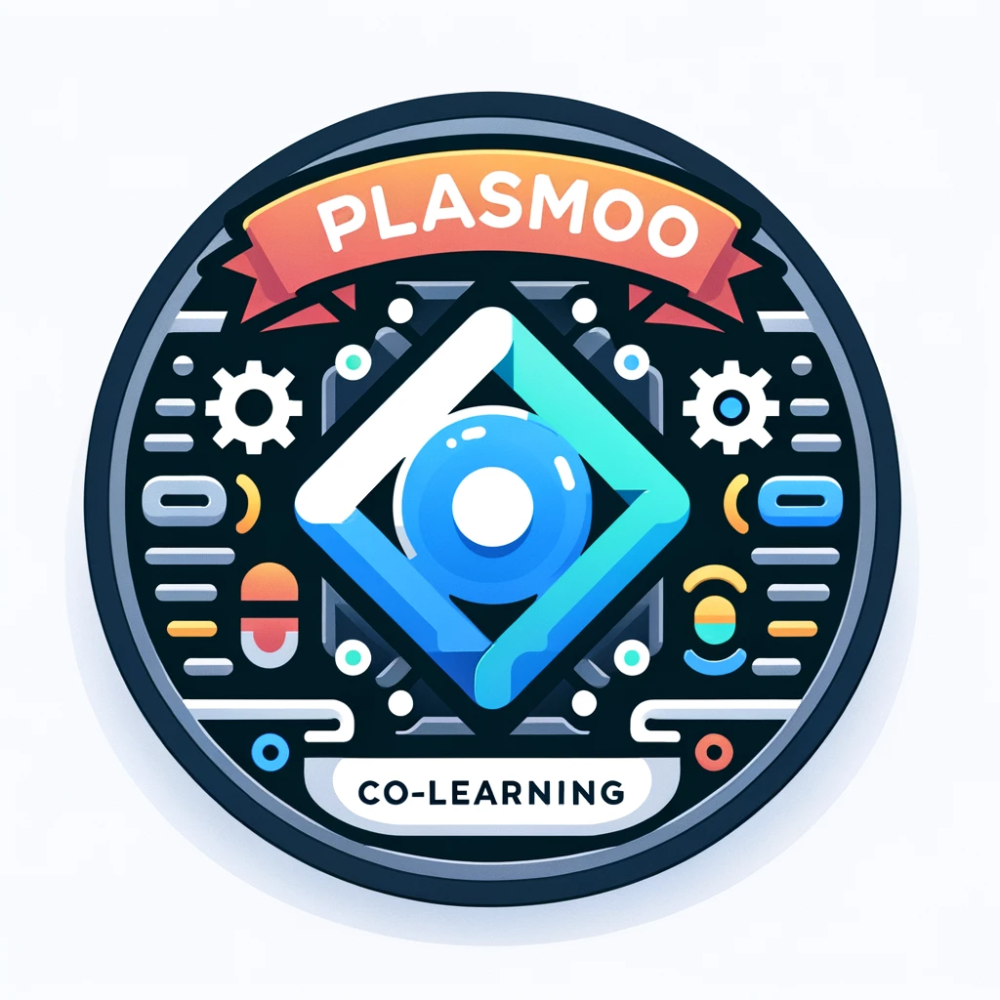

# plasmo-co-learn

本次共学使用 [plasmo](https://docs.plasmo.com/) 完成一个浏览器扩展。构建独立自主的轻量web3接入解决方案。
一种web3接入方案，比纯客户端轻量，比纯网页丰富，介于两者之间的一种web3 接入方案。

## 前置需求

1. 熟悉至少一种编程语言
2. 熟悉至少一种前端架构 : [React](https://react.dev/), [Vue](https://vuejs.org/guide/introduction.html) 等
3. 熟悉 [pnpm](https://pnpm.io/), [yarn](https://yarnpkg.com/cli)  等前端操作工具链

## module1

1. 环境搭建，浏览器扩展各个模块
2. 前端 React 基础

## module2

1. 开发工作流
2. extension pages (tab page, popup page, option page, new tab page, devtool)
3. tab pages
4. sandbox pages

## module3

1. content scripts
2. content scripts ui

## module4

1. background sw
2. message
3. storage
4. remote code

## module5

项目周，项目举例

1. 内容加载交互，在浏览器内网完成数据的管理，比如TODO 项目。书签管理，比如 天气预报这些。
2. 加密钱包项目 (sui，aptos,solana)等
3. 网页增强工具 (增强github 加入和gpt 的交互)等

参考资料：

1. plasmo 官方文档 <https://docs.plasmo.com/>
2. 使用 plasmo的参考示例<https://github.com/PlasmoHQ/examples/> 
3. google Chrome 模块开发文档 <https://developer.chrome.com/docs/extensions/mv3/>
4. 火狐浏览器扩展开发文档 <https://developer.mozilla.org/en-US/docs/Mozilla/Add-ons/WebExtensions>
5. 像素风格 UI 类库 <https://github.com/nostalgic-css/NES.css>