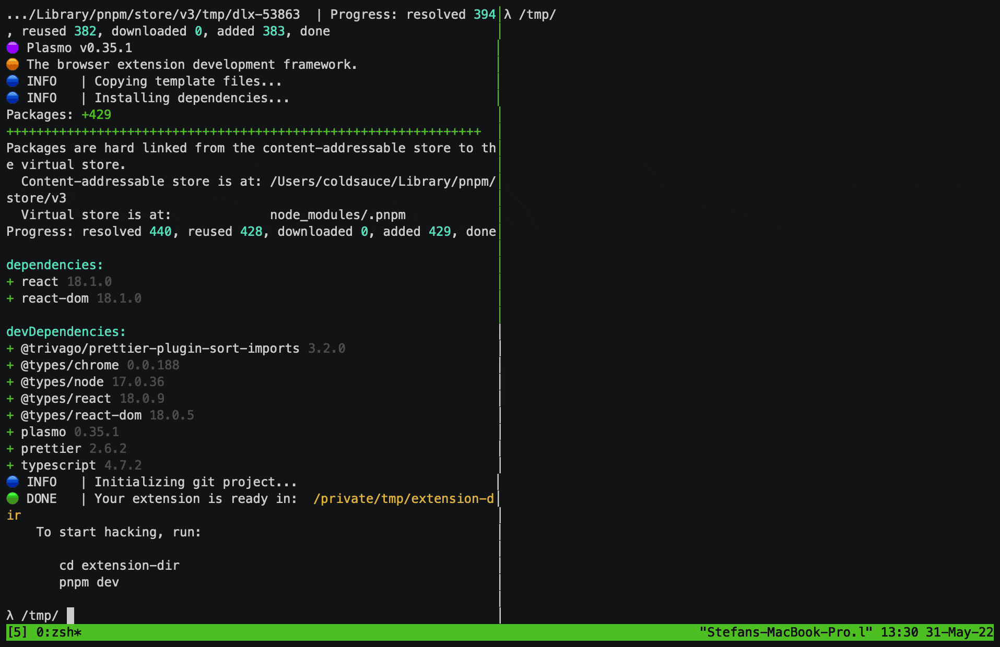
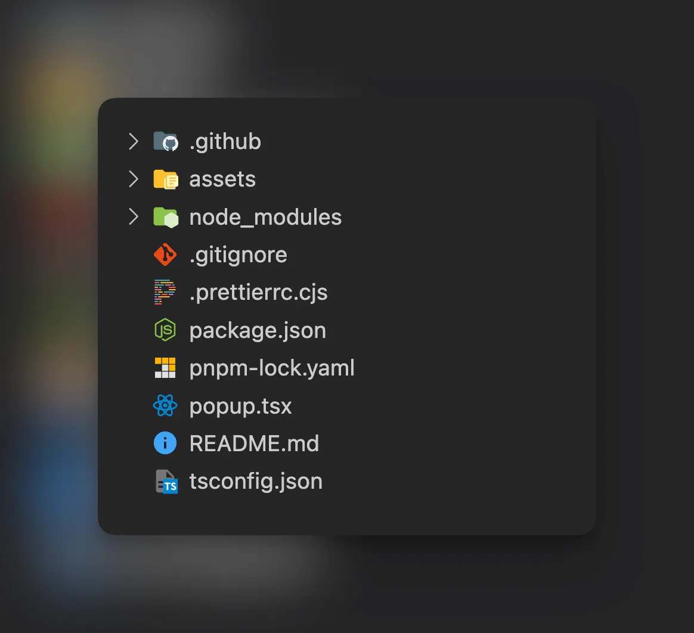
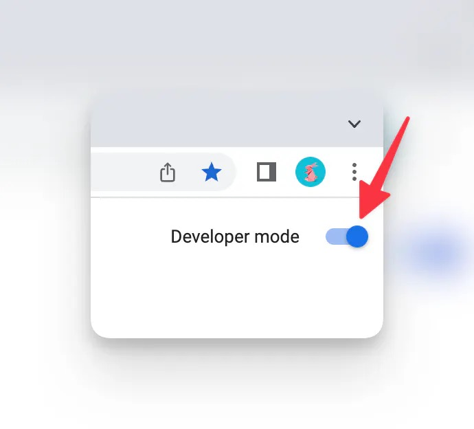
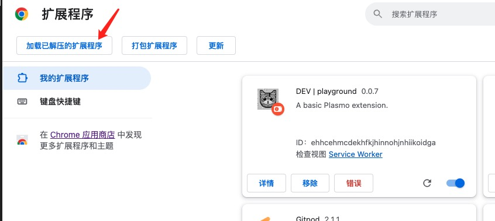
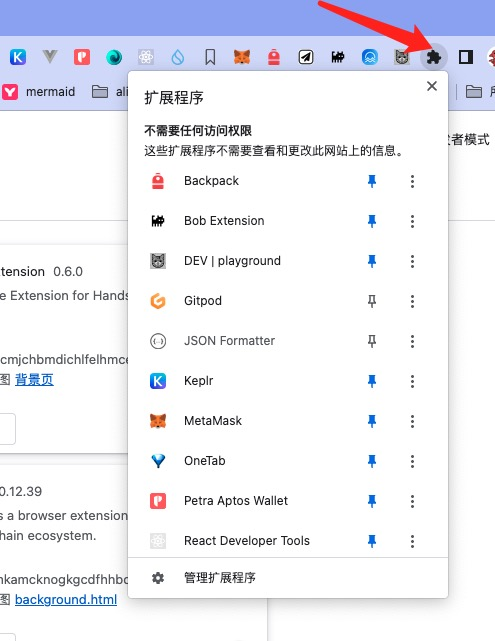

# 开发你的第一个浏览器扩展



## 环境准备

开始之前先检查下你的运行环境。

1. 安装 [Nodejs](https://nodejs.org/en/learn/getting-started/how-to-install-nodejs)。

非常建议你安装多版本管理工具 : [nvm](https://github.com/nvm-sh/nvm)。
如果你是 windows 用户，可能你需要费力一点。 不过还好，相比于其他的开发，你安装完成 `Nodejs` 即可。

2. 安装一个顺手的代码编辑器

你可以选择`Vs Code` 或者 `Web Storm`。因为开发浏览器扩展，和 web 前端开发很接近。所以，需要你按照自己的使用习惯，配置好 自动补全，代码提示这些。

3. 保证你有一个方便快捷的包管理器： `npm`, `pnpm`, `yarn` 均可 , 极力推荐 `pnpm`

4. 一个扩展运行环境，推荐 `chrome`

## 创建项目

使用如下的命令完成，项目初始化：

```shell

pnpm create plasmo
# OR
yarn create plasmo
# OR
npm create plasmo

```

输入项目名称后，你将得到如下的代码目录：



文件目录简单介绍如下:

1. assets 静态资源文件，包括图标，图片等
2. `node_modules` 项目使用到的类库文件，包含了重要的 `plasmo framework`
3. typescript.json 作为 typescript 配置文件
4. package.json

   项目清单文件，**_很重要_** 。`plasmo` 会根据其中定义的内容，和当前项目的文件状况生成 `manifeset.json` 文件。

5. popup.tsx

一个 React Dom 文件。他会在你点击浏览器图标的时候，弹出来。

## 安装调试

```shell
pnpm run dev
```

使用以上命令，你将启动一个`watch`程序，随时，根据你本地的文件变化，重新 package 扩展内容到目录: `build/chrome-mv3-dev`。
打开 chrome 浏览器的 扩展页面 ： [chrome://extensions](chrome://extensions) ，按照下图开启 `开发者模式`。



通过选择加载已解压的扩展程序按钮，把开发调试的扩展加到浏览器中。



最后，在浏览器中激活显示你自己的扩展。


## 做一些修改

打开 popup.tsx, 内容大致如下:

```typescript title=popup.tsx
import { useState } from "react";

function IndexPopup() {
  const [data, setData] = useState("");

  return (
    <div
      style={{
        display: "flex",
        flexDirection: "column",
        padding: 16,
      }}
    >
      <h2>
        Welcome to your
        <a href="https://www.plasmo.com" target="_blank">
          {" "}
          Plasmo
        </a> Extension!
      </h2>
      <input onChange={(e) => setData(e.target.value)} value={data} />
      <a href="https://docs.plasmo.com" target="_blank">
        View Docs
      </a>
    </div>
  );
}

export default IndexPopup;
```

修改完成后，点击扩展图标，你将实时的看到你在 IDE 中做出的修改。

:::tip
`pnpm create plasmo` 可以配置初始化模板，列表在 [example](https://github.com/PlasmoHQ/examples)项目中。
比如: 使用 `pnpm create plasmo --with-mui` 你将初始化一个包含了 `mui` 界面库的扩展开发框架。

同时 : `npm` 和 `pnpm` 传递参数的方式稍有不同。 按照如下方式配对:

```shell
pnpm create plasmo --with-env
# OR
npm create plasmo -- --with-env
```

:::

## 打包预发布

使用 package.json 中定义的 build 文件，打包出 `production`的目录输出。

添加 package 脚本, 打包 zip 文件，可以分发或者上传到： `Itero TestBed`

```typescript
"package": "plasmo build && plasmo package"
```
