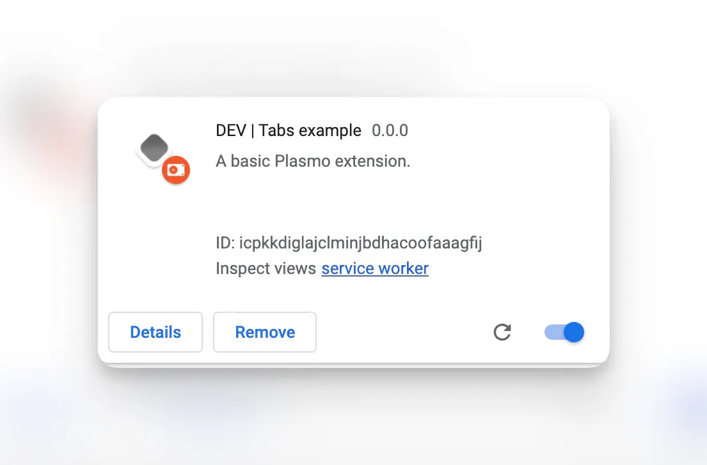

# 静态资源使用

## 资源

## 扩展图标 (icon)

`Plasmo` 会自动把你的图标，缩小。所以，对于多个版本的图标，用户提供较大的即可。
扩展图标路径: assets/icon.png。
当然，如果你对不同大小的图标做了设计也可以按照如下的方式命名。

| icon512 | icon-512 | icon-512x512 | icon1024 | icon-1024 | icon-1024x1024 |
| :------ | :------- | :----------- | -------- | --------- | -------------- |

:::tip
保证你的 图标文件在 assets 目录，并且 后缀名为 .png 的 png 文件。
:::

### 开发模式的图标

开发模式下，`Plasmo` 会自动把你的扩展图标变为灰色，已区分开正常的模式。

### 自定义开发者图标

如果你不喜欢灰色的图标，你也可以保存为 `assets/icon.development.png` 来作为开发模式图标。
