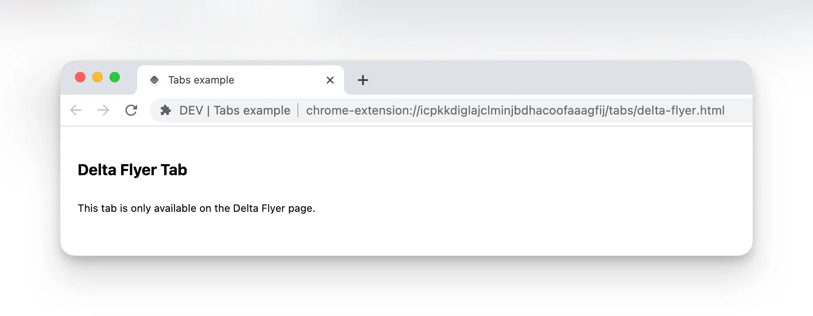

# Tab Pages

这是 `plasmo` 独特的一个功能。不同于 扩展内置页面， `Tab Pages` 只是打包到浏览器扩展中的的常规的页面。
扩展，可以跳转到任意的页面，当然你也可以自己路由到相关页面。

## 使用场景

1. 第一次安装扩展的时候，展示的页面
2. 一个独立的认证页面
3. 当你需要一个更加精准独立的导航时

## 两个实例

1. [with-tabs](https://github.com/PlasmoHQ/examples/tree/main/with-tabs)
2. [rfc-182-tabs](https://github.com/PlasmoHQ/plasmo-test/tree/main/rfc/rfc-182-tabs)

## 使用方法

1. 在 `plasmo` 目录创建 `tabs` 目录
2. 创建 `${name}.tsx` 文件， 最终会生成 `${name}.html` 文件
3. 在 tsx 中导出 `React dom` 元素

比如 你创建了 tabs/delta-flyer.tsx

```typescript
function DeltaFlyerPage() {
  return (
    <div
      style={{
        display: "flex",
        flexDirection: "column",
        padding: 16,
      }}
    >
      <h2>Delta Flyer Tab</h2>

      <p>This tab is only available on the Delta Flyer page.</p>
    </div>
  );
}

export default DeltaFlyerPage;
```

最终将生成 `chrome-extension://$id/tabs/delta-flyer.html` 样子的 html 页面 。



:::tip
tabs 页面不能使用 window.open 跳转。需要使用和 `Background` 的方式来由`Background` 打开。
同时 chrome.tabs.create 只可以打开 本扩展内部的页面，和其他标准的 url。
对于一些 敏感页面，比如 `chrome://extensions/` 通常会打开失败。这也是,chrome 的安全策略。
:::

一种处理方式如下

```typescript
chrome.runtime.onMessage.addListener((message, sender, sendResponse) => {
  if (message.action === "openPage") {
    chrome.tabs.create({ url: message.url });
  }
});
```

前端调用代码

```typescript
chrome.runtime.sendMessage({
  action: "openPage",
  url: "tabs/delta-flyer.html",
});
```
