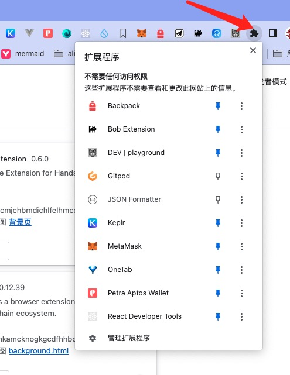

# 开发工作流

这里主要介绍使用 `plasmo` 开发浏览器扩展的工作流。

## 创建项目

通过如下的命令创建 `plasmo` 项目：

```shell
pnpm create plasmo
# OR
yarn create plasmo
# OR
npm create plasmo
```

如果，跳过名字的提示，添加一个扩展的名字即可:

```shell
pnpm create plasmo "My Awesome Extension"
# OR
yarn create plasmo "My Awesome Extension"
# OR
npm create plasmo "My Awesome Extension"
```

:::tip
你也可以把 `plasmo` 安装为全局的对象 `pnpm i -g plasmo`。
:::

### 使用 `src` 作为源码目录

默认情况下，`plasmo` 使用当前项目的文件夹作为代码根目录。 创建项目的时候，使用 --with-src 参数即可

```shell
pnpm create plasmo --with-src
# OR
yarn create plasmo --with-src
# OR
npm create plasmo --with-src
```

如果你的项目已经创建好了，请按照如下的操作:

1. 把所有的源码复制到 `src` 目录。
   然后修改 `tsconfig.json` ： 原来指向 `~*` ，改为 `./src/*`
2. 修改 配置文件源码部分:

```shell
{
  "extends": "plasmo/templates/tsconfig.base",
  "exclude": ["node_modules"],
  "include": [".plasmo/index.d.ts", "./**/*.ts", "./**/*.tsx"],
  "compilerOptions": {
    "paths": {
      "~*": ["./src/*"]
    },
    "baseUrl": "."
  }
}
```

### 指定入口文件

默认的入口文件为 [popup](https://docs.plasmo.com/framework/ext-pages#adding-a-popup-page)。
你可以使用 --entry 设置不同的入口。
这里列出了`plasmo` 支持的 [entries](https://github.com/PlasmoHQ/plasmo/tree/main/packages/init/entries)。

```shell
pnpm create plasmo --entry=options,newtab,contents/inline
# OR
npm create plasmo -- --entry=options,newtab,contents/inline
```

:::tip
npm 不支持 向他的子命令直接传递参数，需要使用 -- 转移传递的参数。
:::

### 使用模板文件

plasmo 官方提供了一个 [模板列表](https://github.com/PlasmoHQ/examples/)。可以选择不同的模板类型初始化:

```shell
pnpm create plasmo --with-env
# OR
npm create plasmo -- --with-env
```

## Development Sever

使用如下的命令启动

```shell
pnpm dev
# OR
npm run dev
# OR
plasmo dev
```

`Plasmo` 将为您的扩展创建一个开发文件夹和一个实时重载开发服务器(一个 websocket 服务器)，文件更改时自动更新您的开发文件夹。
更方便的是当你修改源代码更改时重新加载浏览器。
它还会在扩展名前加上 DEV | 并使图标变成灰度，以区分开发和生产扩展捆绑包。

### 加载扩展

使用 `chrome://extensions` 打开设置页面启用开发者模式。


点击页面 `加载已解压的扩展程序` 选项，在弹出的文件导航中定位到项目的开发目录中的`build`文件夹。

其中可能有两个文件夹:

1. `chrome-mv3-dev` 为开发目录，为开发过程中使用的目录。 `run dev` 的时候会同时触发一个和页面连接的 websocket,更新扩展的时候，除了会重新打包扩展以外。
   页面也会有所反馈。
2. `chrome-mv3-prod` 这里为产品目录，与线上发布后的真实情况没有区别，也可以小范围使用分发测试。

:::tip
有时你无法在 chrome 中看到你的扩展。在 chrome 导航栏的设置中点开，选择 Pin 即可显示出来。

:::

### 选择一个指定的目标文件

我们使用 `plasmo` 开发框架，不只是一个 Chrome 扩展或者 Firefox 扩展。 他应该称之为 `plasmo`扩展。
这也意味着，你可以你可以打包出所有支持的浏览器。你可以使用 `--target` 参数来制定。

```shell
plasmo dev --target=firefox-mv2
```

[支持的目标浏览器列表](https://docs.plasmo.com/framework/workflows/faq#what-are-the-officially-supported-browser-targets)

### 去掉 `source maps`

source maps 为调制程序的时候，他会影响扩展的加载顺序。使用 `--no-source-maps` 去掉

```shell
plasmo dev --no-source-maps
```

### 指定 Server port 和 websocket

按照如下的命令修改 启动的 Server port 和 websocket 端口

```shell
plasmo dev --serve-host=localhost --serve-port-1012
plasmo dev --hmr-host=localhost --hmr-port=1815
```
