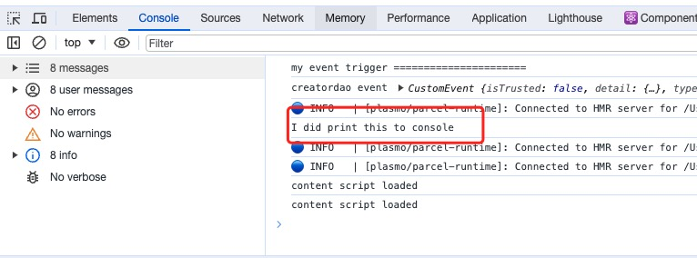

# Content Script

## 简述

在浏览器扩展中，`Content Script`内容脚本）是一种特殊的脚本。
它们在浏览器中运行，但与网页自身的 JavaScript 环境是隔离的。这个隔离环境通常被称为“隔离世界”(isolated world)。
这种设计有以下几个重要意义：

1. 防止冲突
   由于内容脚本运行在隔离的环境中，它不会直接与网页中原有的 JavaScript 代码或其他扩展的内容脚本相冲突。
   这意味着，即使多个扩展都在同一网页上运行内容脚本，它们也不会相互干扰。
2. 安全性
   隔离世界确保了网页原有的 JavaScript 不能直接访问扩展的内容脚本，反之亦然。
   这样做提高了安全性，防止恶意网站访问或修改扩展的内部逻辑。
3. 保护用户数据
   内容脚本可以访问网页内容和一些浏览器 API，但它们不能直接访问扩展的背景页（background page）或其他敏感数据。
   这样做有助于保护用户数据不被未授权的脚本访问。

在 `Plasmo` 中 `.ts` 文件，会被认为是纯脚本文件(不包含 UI 组件)的代码文件。
同时 `.tsx` 则会被认为是 UI 脚本文件，需要有 UI 组件导出。

## 以下列举四种使用场景

1. 从当前页面获取数据
2. 从当前页面选择元素，并设置样式
3. 将 UI 元素注入到当前页面 [content-scripts-ui](https://docs.plasmo.com/framework/content-scripts-ui)
4. 将代码注入到 Main 上下文

## Say Hi to Content Script

在 `Plasmo`目录新建一个 `content.ts` 或者 `contents/index.ts` 。

```typescript title=content.ts
export {};
console.log("I did print this to console");
```

:::tip
因为,`plasmo` 默认使用 `typescript`。 他那任何的一个文件当成一个 `module`。
如果你没有其他的 `import` 或者 `export`, 你需要在开头添加 `export {};`
:::

重新加载你的扩展，打开任何一个页面，然后打开调试模式。
在 `console` 面板你将看到你自己的输出。



官方参考实例 [with-content-script](https://github.com/PlasmoHQ/examples/tree/main/with-content-script)

## 添加多个 `Content Script`

`Plasmo` 帮我们做了一件很酷的事情。
你可以在 `contents` 目录中新建多个 ts 文件，每个 ts 文件都会作为一个独立的 content-script 存在。

官方示例 : [with-many-content-scripts](https://github.com/PlasmoHQ/examples/tree/main/with-many-content-scripts)

## 内容配置

有的时候，你想限制你的`Content-script` 的运行范围、运行位置等信息。
`Plasmo` 给每一个 `Content-script` 一个独立的配置，你可以通过 export 导出。

```typescript
import type { PlasmoCSConfig } from "plasmo";

export const config: PlasmoCSConfig = {
  matches: ["<all_urls>"],
  all_frames: true,
};
```

涉及到的属性及写法，请参看 [chrome 官方给出的解释:](https://developer.chrome.com/docs/extensions/mv3/content_scripts/#static-declarative)。

## 注入到主上下文

如果你想要修改 window 的对象，添加属性，或者方法。 那么，你需要 把你的脚本注入到 `Main world`。

```typescript title=content.ts
import type { PlasmoCSConfig } from "plasmo";

export const config: PlasmoCSConfig = {
  matches: ["<all_urls>"],
  world: "MAIN",
};

window.mainMessage = "this is mainMessage hello world";
window.callProxy = {
  hello: () => {
    console.log("you call me from anywhere in the world");
  },
};
```

修改之前，你需要提前定义好 window 支持的 interface ， 字段内容，或者方法。

```typescript title=index.d.ts
interface Window {
  hello: {
    world: string;
    coolNumber: number;
  };

  mainMessage: string;
  callProxy: {
    hello: () => void;
  };
}
```

## 客户端调用一下

大多数浏览器扩展的 sdk 都是通过 content-script 注入一个全局变量。

同时客户端通过 全局变量的相关方法完成扩展的相关调用的。

```html
<button onclick="clickHandle()">Click Me!!!</button>
<script>
  function clickHandle() {
    console.log(window.mainMessage);
    window.callProxy.hello();
  }
</script>
```

## 手工注入

手工注入脚本，你需要 `chrome.scripting.executeScript` 相关 API。
手工注入，运行在 background 的上下文中，权限也比直接在 content 中注入高一些。
最明显的一点， content 中的脚本必须遵守 CORS 的安全规则。

1. 首先，你需要开启 script 权限

```json
{
  ...
  "manifest" : {
    "permissions": ["scripting"]
  }
}
```

2. 在 background.ts 中触发注入

```typescript title=background.ts
import windowChanger from "./injected-helper";

export {};

const inject = async (tabId: number) => {
  chrome.scripting.executeScript(
    {
      target: {
        tabId,
      },
      world: "MAIN", // MAIN in order to access the window object
      func: windowChanger,
    },
    () => {
      console.log("Background script got callback after injection");
    }
  );
};

// Simple example showing how to inject.
// You can inject however you'd like to, doesn't have
// to be with chrome.tabs.onActivated
chrome.tabs.onUpdated.addListener((tabId, changeInfo, tab) => {
  const { status } = changeInfo;
  const { url } = tab;
  console.table({ url, status });
  if (url && !url.startsWith("chrome://") && status && status == "complete") {
    console.log("let me inject some script!!", changeInfo.status);
    inject(tabId);
  }
});
```

注入辅助函数:

```typescript title=injected-helper.ts
export default function windowChanger() {
  const anotherFunc = (): number => {
    return 42;
  };

  // Here's an example where we can reference the window object
  // and add a new property to it
  window.hello = {
    world: "from injected content script",

    coolNumber: anotherFunc(),
    // you can call other functions from the injected script
    // but they must be declared inside the injected function
    // or be present in the global scope
  };

  // Here's an example where we show you can reference the DOM
  // This console.log will show within the tab you injected into
  console.log(document.getElementsByTagName("html"));
}
```

:::tip
需要 `scripts` 的执行权限。
:::

官方示例 : [with-main-world](https://github.com/PlasmoHQ/examples/tree/main/with-main-world)
