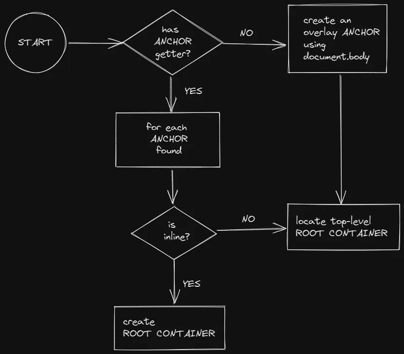
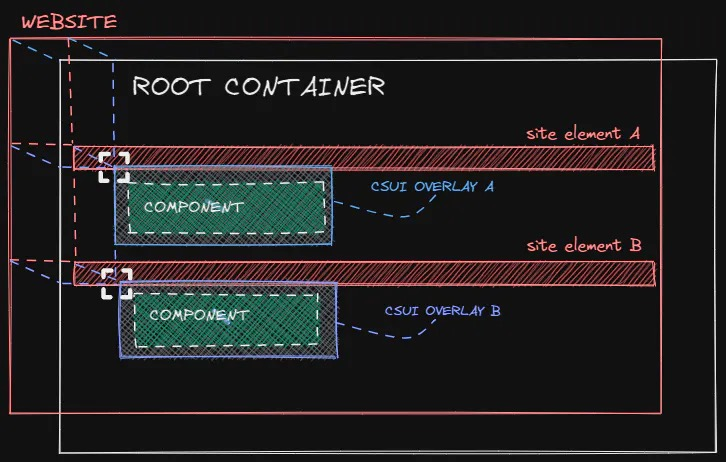
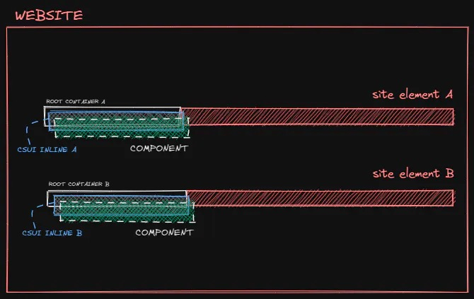
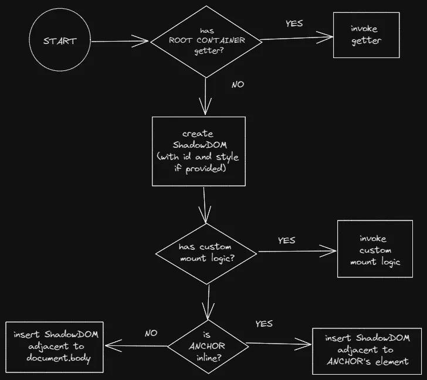
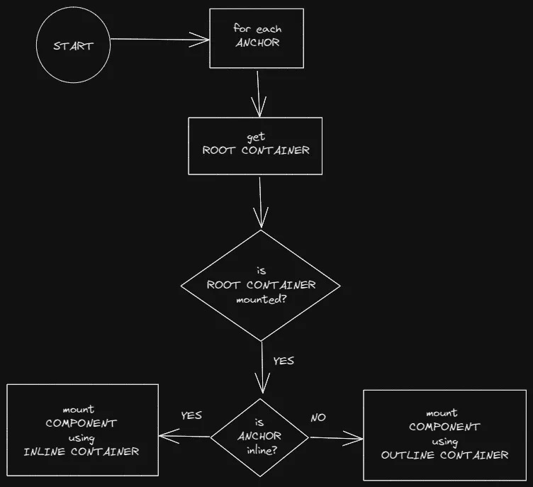

# Content Script UI

## 基础描述

同 `Content Script` 处于同等重要的地位，你可以选择，在各个页面中，注入包含 UI 的部分。
`Plasmo` 对这部分做了封装，你可以很轻易完成需求。

在`Plasmo`中 首先支持在 Web 网页中嵌入 React 、Svelte3、Vue3 组件。 这类功能叫做 `Content Script UI`, 以下简称 `CSUI`。

一个浏览器扩展可以包含多个 `CSUI` 组件， 通过 导出 [Config](https://docs.plasmo.com/framework/content-scripts#config) 对象，可以控制组件的行为。

### 注入一个 `React`组件

1. 创建一个 `content.tsx`
2. 导出一个默认的 `React` 组件。
3. 完成 🎉

```ts title="content.tsx"
const CustomButton = () => {
  return <button>Custom button</button>;
};

export default CustomButton;
```

:::note
当需要多个组件时，你需要创建 `contents` 目录,在该目录下创建组件文件。
:::

完整实例 : [with-content-scripts-ui](https://github.com/PlasmoHQ/examples/tree/main/with-content-scripts-ui)

### 配置项

因为, CSUI 也是 Content Script 的子集，所以，共享一个[内容配置](content#内容配置)。

### 他是怎么工作的呢？

`Plasmo` 创建了一个 [Shadow DOM](https://developer.mozilla.org/en-US/docs/Web/API/Web_components/Using_shadow_DOM)。
在其中挂载了你导出的 UI 组件。这种机制有效保证了你的组件样式的独立性，即不受页面样式影响。

## 生命周期

`Plasmo` 的 `CSUI` 负责协调一个专门用于在内容脚本中挂载和卸载你的 React、Vue 或 Svelte 组件的生命周期。
尽管每个 UI 库/框架的挂载 API 略有不同，但顶级生命周期大体相同：

1. 获取一个 [Anchor](#anchor) (定位器)
2. 创建，或者获取一个 [容器](#root-container)， 该容器用于定位 `CSUI` 的元素。
3. [Render](#renderer) 渲染导出 的 UI 组件。

### 相关概念

| 名词           | 相关描述                                            |
| :------------- | :-------------------------------------------------- |
| Anchor         | 告诉 CSUI 挂载你的组件的位置和方法。                |
| Anchor-getter  | 告诉 CSUI 怎么找到你的 Anchor。                     |
| Overlay        | Overlay 模式挂载你的组件，挂载在当前页面的 最上层。 |
| Inline         | 挂载你的组件在页面的 Dom 里，紧挨着你的 目标 Dom。  |
| Root Container | 一个 由 Plasmo 创建的 ShadowDOM 用来包装你的组件。  |
| Renderer       | 最上层的渲染结构，包含了以上的所有方法。            |

## Anchor



以上流程图描述了在网页中处理（ANCHOR）元素的一系列步骤。

流程开始于“START”，然后遵循以下步骤：

1. **检查是否存在 ANCHOR 获取器（has ANCHOR getter?）**：

   - 如果没有（NO），则在`document.body`中创建一个覆盖层锚点（overlay ANCHOR）。
   - 如果有（YES），则继续下一个步骤。

2. **遍历找到的每一个锚点（for each ANCHOR found）**：
   这一步是对页面中所有锚点进行循环。

3. **检查锚点是否为内联（is inline?）**：
   - 如果锚点是内联的（YES），那么创建一个根容器（ROOT CONTAINER）。
   - 如果锚点不是内联的（NO），那么定位到顶层的根容器（locate top-level ROOT CONTAINER）。

定义一个 `Anchor`

```ts
export type PlasmoCSUIAnchor = {
  type: "overlay" | "inline";
  element: Element;
};
```

默认的 `Plasmo` 提供一个默认的 Anchor 他在 `document.body` 作为 Element , 以 Overlay 模式呈现。

```ts
{
  type: "overlay",
  element: document.body
}
```

如果 `CSUI` 文件中定义了 getter 函数 ，那么 `CSUI` 将会使用该函数返回的元素作为 Anchor。
因为 ，函数定义可以使用 async 异步，所以，你也就可以掌控你的 Anchor 的位置。
比如，你可以一直等待页面上出现某个元素，然后，再返回定义的 元素。

函数定义为 : **getOverlayAnchor** 和 **getInlineAnchor**。

当你导出的 UI 元素需要和 Anchor 交互的时候，你可以传递 `PlasmoCSUIProps`属性。

```ts
import type { PlasmoCSUIProps } from "plasmo";

const AnchorTypePrinter: FC<PlasmoCSUIProps> = ({ anchor }) => {
  return <span>{anchor.type}</span>;
};

export default AnchorTypePrinter;
```

### Overlay



Overlay 的嵌入模式，是以当前页面最大的 z-index 渲染导出的 Dom 结构的。
一个 `CSUI` 文件可以导出多个 Overlay Anchor，每一个 Anchor 都会派生出一个容器， 以渲染新的 Dom 。
一个 CSUI 内的所有容器，从属于同一个根容器。

单一的 Overlay Anchor

```ts
import type { PlasmoGetOverlayAnchor } from "plasmo";

export const getOverlayAnchor: PlasmoGetOverlayAnchor = async () =>
  document.querySelector("#pricing");
```

返回 多个 Anchor

```ts
import type { PlasmoGetOverlayAnchorList } from "plasmo";

export const getOverlayAnchorList: PlasmoGetOverlayAnchorList = async () =>
  document.querySelectorAll("a");
```

:::tip
getOverlayAnchorList 暂时还不支持动态获取，比如，CSUI 渲染完后新加入的 dom ，无法完成后期的渲染。
:::

#### watch 更新位置

默认 Overlay Anchor 监听了 window 的滚动事件，保证 自己和 Anchor 定位的元素对齐。
由于某些其他原因，位置变动的时候，无法跟随。Plasmo 给大家提供了 PlasmoWatchOverlayAnchor , 可以轮询变更定位器的位置。

```ts title="with-content-scripts-ui/contents/plasmo-overlay-watch.tsx"
import type { PlasmoWatchOverlayAnchor } from "plasmo";

export const watchOverlayAnchor: PlasmoWatchOverlayAnchor = (
  updatePosition
) => {
  const interval = setInterval(() => {
    updatePosition();
  }, 8472);

  // Clear the interval when unmounted
  return () => {
    clearInterval(interval);
  };
};
```

具体实例 : [with-content-scripts-ui/contents/plasmo-overlay-watch.tsx](https://github.com/PlasmoHQ/examples/blob/main/with-content-scripts-ui/contents/plasmo-overlay-watch.tsx)

### Inline



Inline 模式是把 CSUI 的元素嵌入到 web 页面中，紧挨着你定位到的元素。
同上一个 CSUI 文件中定位到 一个或多个 Anchor, 派生出 Inline 模式的 容器，承载你导出的 Dom.

单一的 Inline Anchor

```ts
import type { PlasmoGetInlineAnchor } from "plasmo";

export const getInlineAnchor: PlasmoGetInlineAnchor = async () =>
  document.querySelector("#pricing");
```

返回多个 Inline Anchor

```ts
import type { PlasmoGetInlineAnchorList } from "plasmo";

export const getInlineAnchorList: PlasmoGetInlineAnchorList = async () =>
  document.querySelectorAll("a");
```

官方实例 : [with-content-scripts-ui/contents/plasmo-inline](https://github.com/PlasmoHQ/examples/blob/main/with-content-scripts-ui/contents/plasmo-inline.tsx)

## Root Container



Root Container 是你嵌入页面的 UI Dom 最终挂载的地方。

默认情况下，Plasmo 使用了 plasmo-csui 的自定义标签，作为页面的 ShadowDOM 元素。

使用这种机制，你就可以实现自定义样式，同时和页面的主样式隔离开。

### 自定义挂载 Dom

Root Container 会创建 shadowHost 来其纳入当前页面的 Dom 树。

默认情况下的注入

1.  inline anchor : `Plasmo` 在 指定定位元素的后边创建 shadowHost
2.  Overlay Anchor : 会在 document.body 前边注入。

你可以通过导出一个 `mountShadowHost` 函数实现自定义挂载。

```ts
import type { PlasmoMountShadowHost } from "plasmo";

export const mountShadowHost: PlasmoMountShadowHost = ({
  shadowHost,
  anchor,
  mountState,
}) => {
  anchor.element.appendChild(shadowHost);
  mountState.observer.disconnect(); // OPTIONAL DEMO: stop the observer as needed
};
```

### 关闭 Shadow Root

默认情况下 Shadow Root 是 open 的状态，即 允许任何人(扩展开发者、扩展使用者)查看 Shadow Root 的 Dom 树。
有时候，你不希望这种情况发生，你需要导出 PlasmoCreateShadowRoot 函数实现自定义挂载。

```ts
import type { PlasmoCreateShadowRoot } from "plasmo";

export const createShadowRoot: PlasmoCreateShadowRoot = (shadowHost) =>
  shadowHost.attachShadow({ mode: "closed" });
```

:::tip
经过实验，暂时没有发现什么区别。
:::

### 自定义样式

Plasmo 内置 给扩展开发者提供了一种安全的修改 CSUI 样式的机制。

通过 getStryle 返回一个 [Style Element](https://developer.mozilla.org/en-US/docs/Web/API/HTMLElement/style)

更多样式需求，参看 [Style](#style) 部分。

### 自定义 Root 容器

有时候，你需要完全替换掉 Plasmo 提供的 Shadow DOM 以满足你自己的需求。

比如 ，你可能想从页面中选择一个元素，作为 Root Container 而不是创建一个。

你可以通过 导出 getRootContainer 实现自定义容器的需求

```ts
import type { PlasmoGetRootContainer } from "plasmo";
export const getRootContainer = () => document.getElementById("itero");
```

这么做的其他几个理由:

1. 扩展可能集成宿主页面的样式
2. 扩展想把 CSUI 元素挂在到页面上，而不是使用 CSUI 本身。
3. 扩展打算使用 iframe 作为内容载体。

:::tip
当你使用 getRootContainer 导出函数自定义 Root Container 以后。 Plasmo 将会忽略其他的内置的函数，
比如 getStyle getShadowHostId 。如果你需要这些函数，你必须手工调用。
:::

官方提供的实例 : [with-content-scripts-ui/contents/plasmo-root-container.tsx](https://github.com/PlasmoHQ/examples/blob/main/with-content-scripts-ui/contents/plasmo-root-container.tsx)

## Renderer



:::tip
https://docs.plasmo.com/framework/content-scripts-ui
:::
