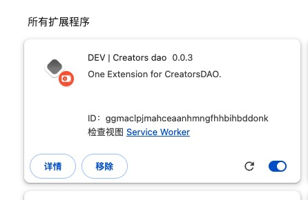
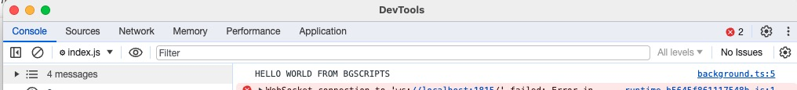

# Background Service Worker

## 相关介绍

浏览器扩展也分为 `Background`，它运行的上下文 称为 [Service 上下文](https://developer.mozilla.org/en-US/docs/Web/API/Service_Worker_API/Using_Service_Workers)。
在这个上下文，你可以脱离开很多束缚，尽可能发挥你的想象空间。 比如: 你再也不用担心 `CORS` 限制，可以获取你想要的任意的资源。
通常的操作是把一些，相对耗时的操作放在后台执行。

### 基础使用

`plasmo` 提供了一个及简单的方式添加 `Background`。 在 `plasmo`目录创建`background.ts`即可。

```typescript title=background.ts
export {};

console.log(
  "Live now; make now always the most precious time. Now will never come again."
);
```

:::tip
因为,`plasmo` 默认使用 `typescript` 。他那任何的一个文件当成一个 `module`。
如果你没有其他的 `import` 或者 `export`, 你需要在开头添加 `export {};`
:::

重新加载你的扩展，打开 `Service Worker`。



点开 `Service Worker` 列表。


恭喜你! 你推开了新世界的大门。

官方提供的实例可以参考： [with-background](https://github.com/PlasmoHQ/examples/tree/main/with-background)

### 数据持久化

:::tip
使用 `plasmo` 开发的模块 在 `dev` 模式下， Service 总保持 active 的状态。
:::

通常情况下，浏览器的扩展空闲 5 分钟左右，就会被浏览器当做空闲进程清理。
清除以后，你的 `Service` 脚本中的数据将会消失。

所以，你需要一个存储库，保持你的上下文信息。

[storage](https://docs.plasmo.com/framework/storage) 模块可以解决这个问题。
当然，更高级的办法是通过`fetch` 或者 `websocket`将本地的状态存储到远端的数据库。

## Background 使用实例

### 创建自定义上下文菜单 `contextMenu`

在 `background.ts` 中添加定义:

```typescript title=background.ts
chrome.runtime.onInstalled.addListener(() => {
  // 创建上下文菜单项
  chrome.contextMenus.create({
    id: "myExtensionOpenPage",
    title: "Open My Page",
    contexts: ["all"],
  });

  chrome.contextMenus.create({
    id: "Github",
    title: "Open Github",
    contexts: ["all"],
    parentId: "myExtensionOpenPage",
  });
});

// 监听上下文菜单的点击事件
chrome.contextMenus.onClicked.addListener((info, tab) => {
  if (info.menuItemId === "Github") {
    // 要打开的页面 URL
    const pageUrl = "https://creatorsdao.github.io/plasmo-co-learn/docs/intro/";

    // 打开新标签页
    chrome.tabs.create({ url: pageUrl });
  }
});
```

然后在 `package.json` 中添加权限声明:

```typescript title=package.json
....
"permissions": [
      "tabs","commands"
],
....
```

以上就创建了一个右键跳转 Github 的上下文菜单。
